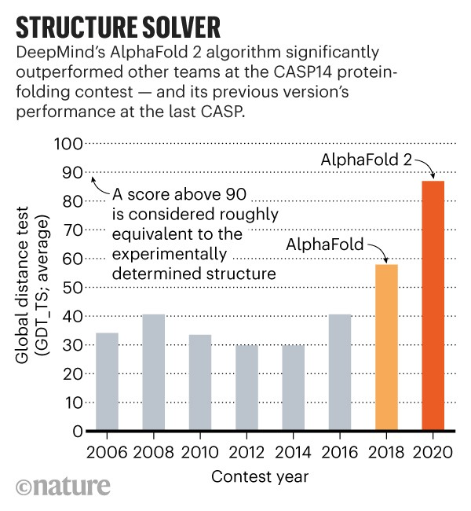

## Presentation: "Using Transformers to produce breakthroughs in medicine" [(Web version)](https://burnpiro.github.io/molbert-presentation)

#### Generated using [Presentation Template](https://github.com/burnpiro/presentation-template)

#### TL;DR

In last year, there was an increase in the use of transformers in almost every field of ML. One of those fields is Medicine, where the introduction of AlphaFold2 during the CASP14 competition took all the headlines. AlphaFold2 managed to beat the competition by a huge margin and in an option of many, "solved the protein folding problem". 

Google Brain team still didn't release the paper on this model but AlphaFold2 was not the only transformer model which aims to help with biological/chemical problems. Another example of transformer usage in medicine is MolBERT. This BERT-like model, presented on NeurIPS 2020 managed to beat 6 SOTAs from MoleculeNet (set of benchmarks) by learning representation of the molecules using SMILE language. Important thing was that MolBERT was trained using just 2 GPUs which is achievable by a small size company and doesn't require the resources of giants like Google.

## License
MIT licensed
Copyright (C) 2021: [Kemal Erdem](https://github.com/burnpiro)
